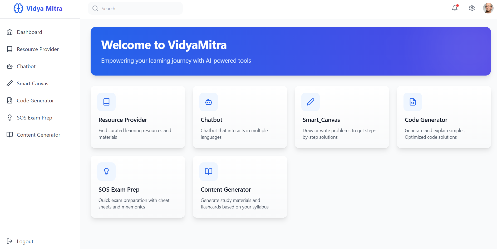
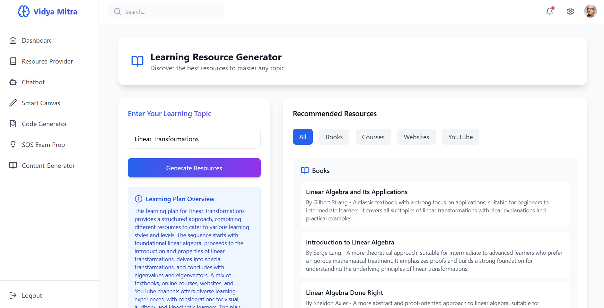
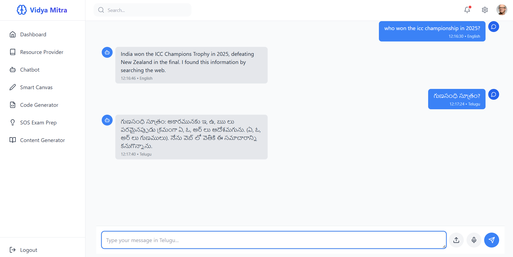
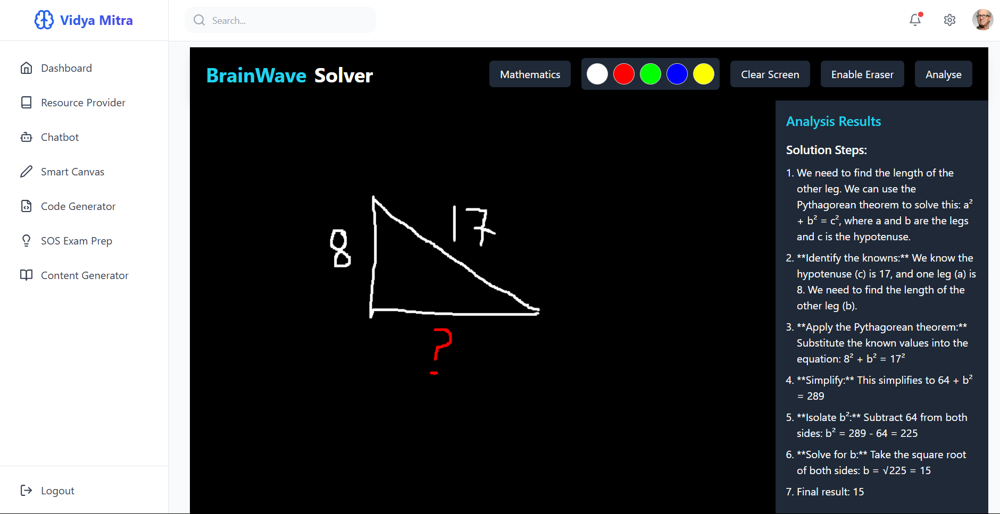
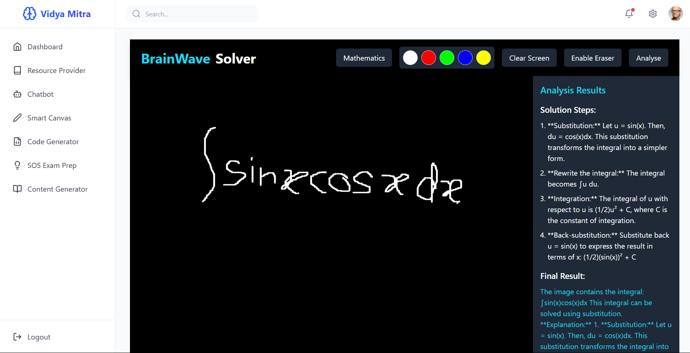
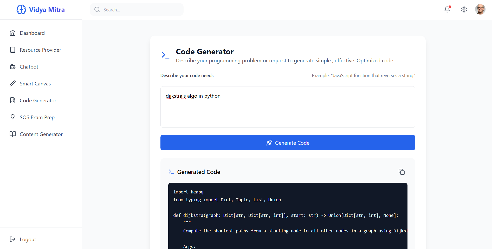
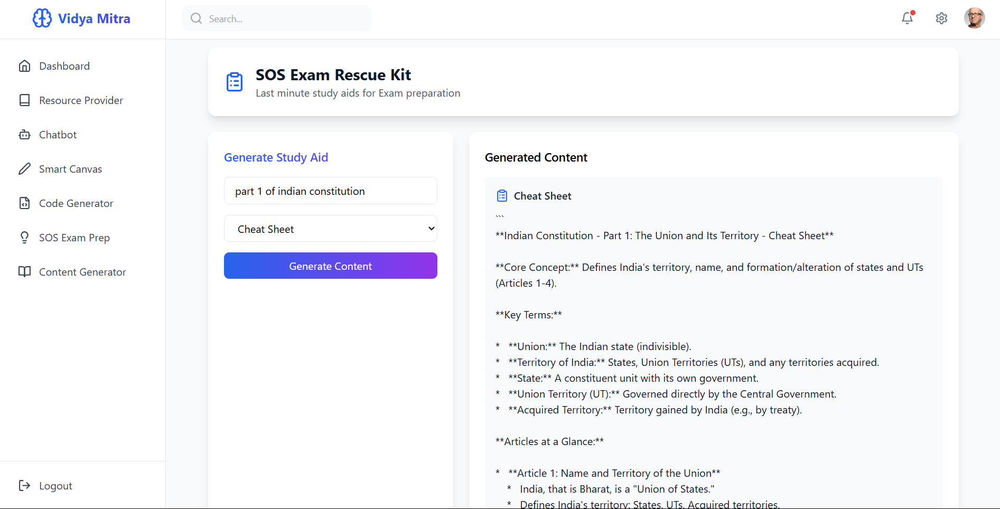

# Vidya Mitra: AI Agents United for Educational Excellence



[📺 Watch Demo Video](https://drive.google.com/file/d/1eIehR4QUnKA_NNgQTPzt77drfhdQopXO/view?usp=sharing)
## [ Website Link](https://vidya-mitra-frontend-two.vercel.app/)

> Making learning easy and effective through AI-powered education
> > Built Totally upon AI Agents

## 🌟 About Vidya Mitra

Vidya Mitra is a comprehensive education platform built to transform how students learn by leveraging advanced AI technologies. We believe learning should be accessible, personalized, and effective for everyone. Our platform combines multiple AI agents working together to create an intelligent learning companion that adapts to your needs.

## ✨ Key Features

### 📚 Resource Generator


Finding quality learning materials has never been easier:
- Enter any topic of interest
- Our AI agents search the web in real-time
- Receive curated recommendations of trending books, courses, websites, and YouTube channels
- All resources are presented in an organized, easily digestible format

**How it works:**
```
Topic Input → AI Agents Collaboration → Internet Search → Resource Collection → Organized Results
```

### 💬 Intelligent Chatbot


A versatile learning assistant that:
- Answers questions with up-to-date information by searching the internet when needed
- Supports multiple languages to serve a diverse user base
- Remembers your conversation history to provide contextually relevant responses
- Adapts to your learning style over time

**How it works:**
```
User Query → LLM Knowledge Check → Internet Search (if needed) → Memory Storage → Personalized Response
```

### 🖌️ Smart Canvas



Solve complex problems visually:
- Draw mathematical equations or diagrams directly on the canvas
- Our system converts your drawings into solvable format
- Receive step-by-step solutions with explanations
- Perfect for visual learners and mathematical problem-solving

**How it works:**
```
Draw on Canvas → Image to Variable Conversion → LLM Processing → Solution Generation → Step-by-Step Explanation
```

### 💻 Code Generator


Accelerate your programming journey:
- Request code in any popular programming language
- Our dual-agent system generates clean, functional code
- Code is automatically optimized for efficiency and readability
- Includes comments and explanations to help you understand the implementation

**How it works:**
```
Code Request → Agent 1: Code Generation → Agent 2: Code Optimization → Documentation Addition → Final Code Delivery
```

### 🚨 SOS Exam Prep


Last-minute study made effective:
- Choose from cheat sheets, memory aids, or common mistakes guides
- Receive condensed, high-value study materials for any topic
- Materials are crafted using web research and expert knowledge
- Perfect for quick revision before exams

**How it works:**
```
Topic Selection → Format Choice → AI Knowledge Base Check → Internet Research → Targeted Study Material Creation
```

### 📝 Content Generator

Learning materials tailored to your expertise:
- Select your topic and proficiency level (Beginner/Intermediate/Advanced)
- Receive comprehensive, well-structured content
- Materials are created by analyzing the best resources available online
- Content focuses on the most valuable concepts for your selected level

**How it works:**
```
Topic & Level Selection → AI Agents Web Research → Content Curation → Level-Appropriate Formatting → Comprehensive Material Delivery
```

## 🛠 Technology Stack

- **AI Models**: Powered by Gemini models for intelligent responses
- **Agent Framework**: Built on CrewAI for collaborative AI agent workflows
- **Backend**: FastAPI for high-performance API endpoints
- **Frontend**: React for a responsive and intuitive user interface

## 🚀 Getting Started

### Prerequisites
- Python 3.8+
- Node.js 14+
- API keys for Gemini

### Installation

```bash
# Clone the repository
git clone https://github.com/yourusername/vidya-mitra.git
cd vidya-mitra

# Set up backend
cd backend
python -m venv venv
source venv/bin/activate  # On Windows: venv\Scripts\activate
pip install -r requirements.txt

# Configure your API keys
cp .env.example .env
# Edit .env with your API keys

# Start the backend
uvicorn main:app --reload

# Set up frontend (in a new terminal)
cd ../frontend
npm install
npm start
```

Visit `http://localhost:3000` to see Vidya Mitra in action!

---

© 2025 Vidya Mitra Team | [Contact Us](https://www.linkedin.com/in/rakesh-tirlangi/)
